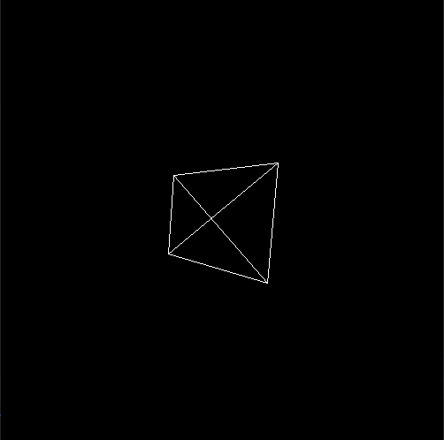
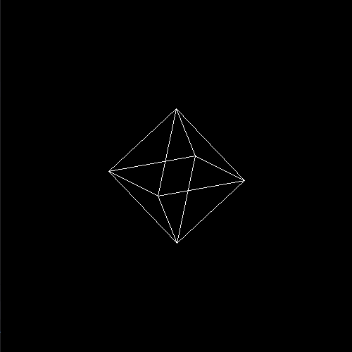

# Pygame 3D Test

A simple project that shows off basic 3D rendering in Pygame.

| Cube                      | Tetrahedron                      | Octohedron                      | Icosahedron                      |
| ------------------------- | -------------------------------- | ------------------------------- | -------------------------------- |
|  |  |  |  |

### Requirements

You'll need Python 3 with Pygame, NumPy and SciPy installed.

You can install the required packages via:

```
pip install -r requirements.txt
```

### Basic usage

To run the example:

```
python main.py
```

Use the arrow keys :arrow_up: :arrow_down: :arrow_left: :arrow_right: to rotate the 3D object.

You can change the 3D object by modifying the following line in `main.py`:

```python
poly = polyhedron.create_cube()
```

### Cool features to implement

Here are some cool features that might be worth implementing.

* Perspective projections
* Shading / solid body
* 3D animations / transformations
